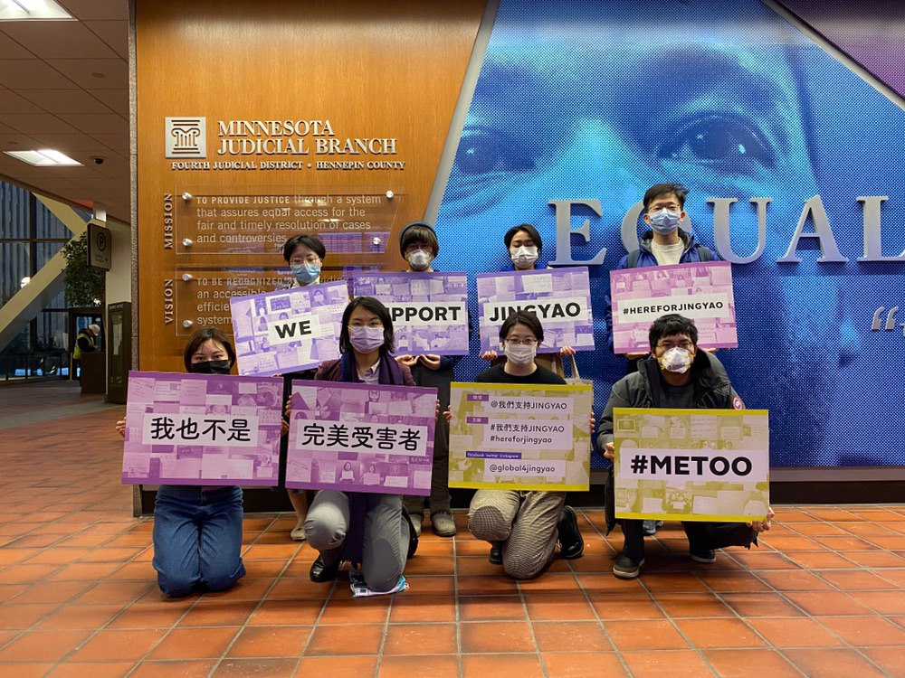

【Jingyao诉刘强东案第二次庭审详细文字视频总结】

1. 本次庭审持续了一个小时左右，主要的争论焦点是京东对刘强东涉嫌袭击行为是否有连带责任（vicarious liability)。
1.1. 京东认为刘强东的涉嫌袭击行为属于刘强东的个人行为，与公司无关，要求法官判决解除（dismiss）针对他们的起诉。
1.2. Jingyao律师认为，刘强东在涉嫌袭击时，运用了公司资源，属于职务行为。同时，京东作为公司，有预见刘强东该行为可能造成对他人伤害的可能性（foreseeability),因此京东应该承担责任。
1.3. 法官会在90天内就京东律师的动议作出判决。

2. 另外，我们得知，昨天（1月27日）被临时安排了庭审。昨天的听证会有两个议题：
2.1. 是否允许明尼苏达日报记者在今日的听证会上拍照
2.2. 讨论起诉书送达可能的替代方式：起诉书已经通过相关国际条例规定，送达给中国中央对应部门（已确认这一步的送达）。但现在不确认可以在60天内将起诉书送达给刘强东本人。Jingyao律师提议诉诸“替代性送达”方式，即送达给刘强东本人之前的刑事律师，作为送达的标准。
2.3. 与此同时，上次庭审关于起诉文书送达给刘强东个人的听证将在今年4月3日再次举行。法官表示，如果4月3日还无法送达，当日的讨论议题可以替换成scheduling order。Scheduling order指确认接下来案子的时间线，包括什么时候完成取证计划，陪审团筛选等等。

 本次共有12名来自加州、纽约、明尼苏达等全美各地的Jingyao支持者来到现场旁听。我们后续还会再发布第二个视频，分享庭审趣事和旁听感想。

jingyao全球应援团未来到将持续关注本案Jingyao, 去庭审现场为大家带来最新的前线消息。加入我们。也希望世界各地的朋友能关注微博我们支持Jingyao, 用自己能做的事情表达对Jingyao的相信和支持。
#我们支持jingyao##hereforjingyao#
